### Vishal Bhalla

### October 25, 2016

## Predict Defaults on Loans

Definition

**Project Overview:**

As people tend to be complicated, so do their credit profiles. The
problem of evaluating credit profiles can be solved by harnessing the
information in the Kaggle Lending Club dataset [LC Data](https://www.kaggle.com/wendykan/lending-club-loan-data/downloads/lending-club-loan-data.zip),
through a machine learning model. This data centric approach is robust
and adds a new dimension to evaluating any individual requesting credit,
thereby augmenting the toolset of underwriters and streamlining the
decision process.

**Problem Statement:**

Given a bunch of characteristics of a credit profile, can I develop a
model that is more predictive than simply leveraging the credit ratings
alone. ­In this project we look to choose relevant borrowers'
characteristics, possibly transform and combine those features to input
into a selection of algorithms that will hopefully predict the
borrower's probability of default better than simply using the ratings
provided in isolation.

**Ordering of Notebooks:**

There are a lot of challenges working iwth these data sets, in terms of
performance and much needed work on feature transformations. Therefore,
I broke out the components of the ETL into sequential notebooks.

[LC Data](https://www.kaggle.com/wendykan/lending-club-loan-data/downloads/lending-club-loan-data.zip)

LCDataDictionary.xlsx - Glossary of field names

LoanStats2014.csv - input to DataCleansing2014FeatureExtraction

[Data Preparation Notebook Sequence:]

1\_DataCleansing2014FeatureExtraction.ipynb

2\_Exploratory Analysis.ipynb

3\_EmpTitleFuzzyWuzzyFeatureExtraction.ipynb

4\_GeoEmpTitle\_Feature\_Extraction.ipynb

Once the above are imported, then we can run the model development
notebooks (Logistic Regression, Random Forest, etc.)

**Metrics:**

This is a binary classification problem (1=Default and 0=No Default) and
the number of defaults in a pool of loans is relatively low \~12%. This
means that the classes are unbalanced (significant proportion of one
class compared to the other). In this case, Accuracy is a metric that
says basically explains how many of your 1s or 0s (defaults vs.
non-defaults) were correctly outputted by your model. In cases of
unbalanced classes though, this metric sometimes is a bit too
simplistic. Consider the example above (12% of the loan pool has
defaulted), a model that simply outputs a 0 every time will have an
accuracy of \~88%.

The AUC (the area under the Receiver Operating Characteristics Curve)
tends to provide more useful information in the case above as it deals
with probabilities and thresholds for classification.

*The ROC Curve (figure below)*

TPR -- True Positive Rate (Proportion of positives that are correctly
identified)

FPR -- 1 -- Specificity (Specificity is proportion of negatives that are
correctly identified)

As you can see, the farther up and to the left, the better fit a model
has.

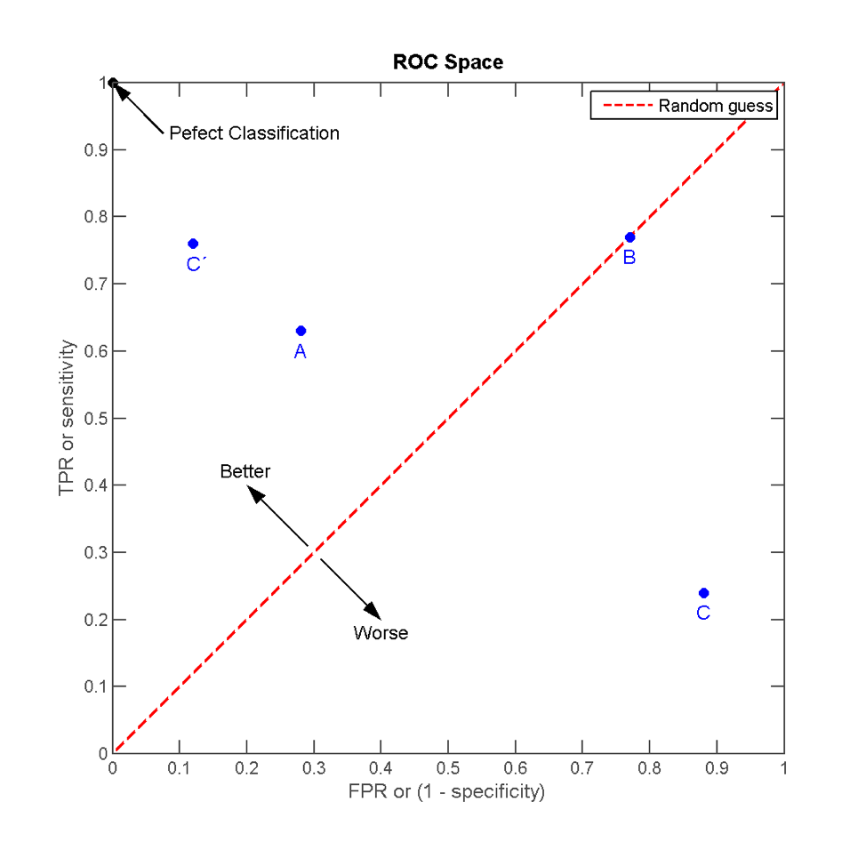
(https://en.wikipedia.org/wiki/Receiver\_operating\_characteristic)

The AUC considers all possible thresholds in different true
positive/false positive rates and this relationship is the ROC curve
above. Therefore, we will be using this metric for model selection and
evaluation as it's best suited for this unbalanced class problem.

Analysis

**Dataset:**

The dataset enclosed consists of 235,631 loans with 115 attributes.

**Structure of Data Files:**

*./Data/LCDataDictionary.xlsx -* feature dictionary

*1_DataCleansing2014FeatureExtraction.ipynb* - Notebook used for initial
inspection and relevant feature extraction

*2_Exploratory Analysis.ipynb - Notebook containing data exploration
and visualization*

**Data Exploration:**

[Default Distribution:]

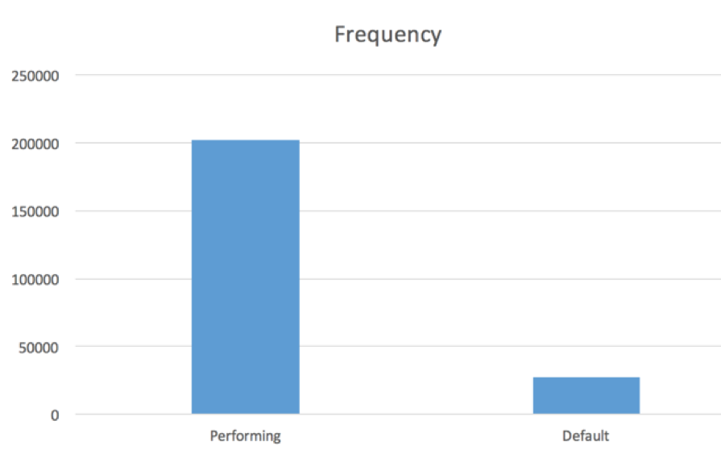

\*We're defining defaults via the Loan\_Status feature as anything loan
that is greater than 30 days late or greater.

[Distribution of Timing of Defaults From Loan Origination:]

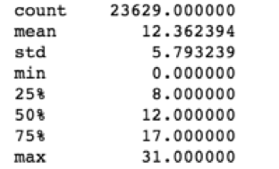

-50% of the defaulted loans occur within 1 year (12 months)

[Distribution of Employer Length]

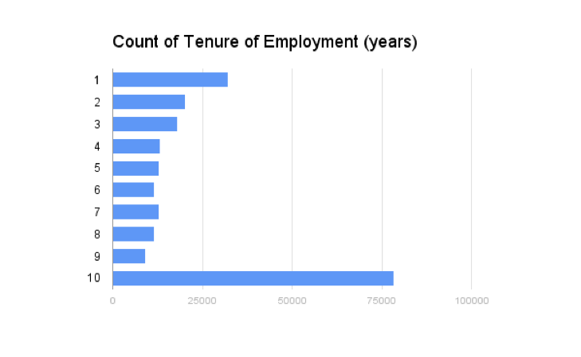

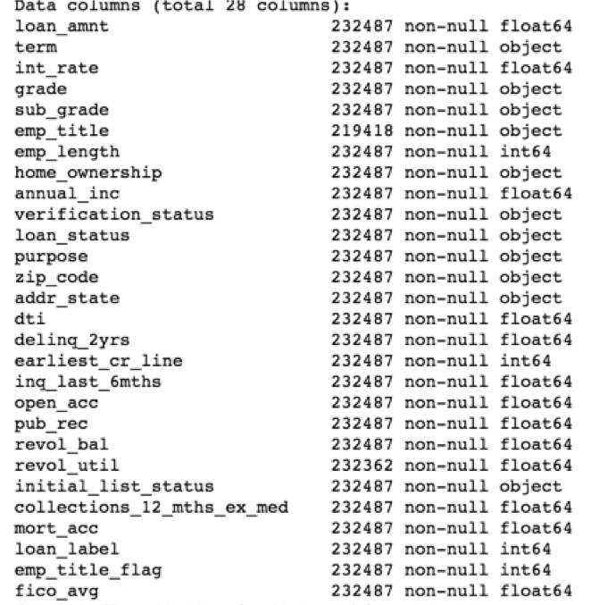

\*After inspecting all the features and removing all features that are
populated after loan origination (monitoring metrics not available at
time of loan issuance, hence not valuable for developing a predictive
model of loan defaults occurring prior to loan issuance) we are left
with 28 features.

\*All definitions are located in the LCDataDictionary.xls file enclosed
in the data folder

-As you can see we have a lot of categorical data, particularly employee
title containing 60k unique lines of text and 3 digit zip codes which
have 894 unique zip codes. We'll address these categorical values
separately.

[Frequency Of Loan Balances On Defaulted Loans]

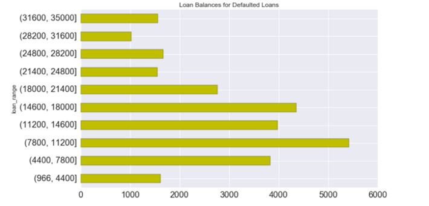

[Default Rates by Loan Tenure and Employee Title Population]

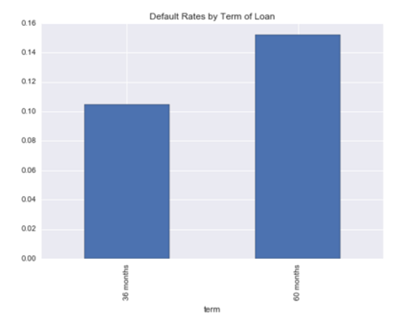 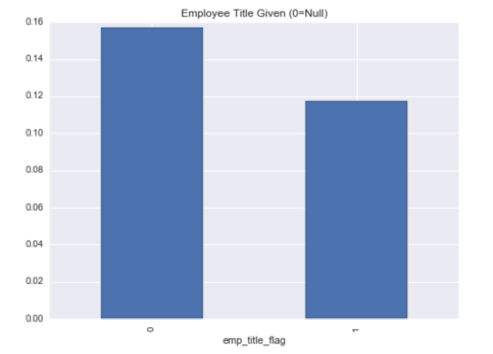

\*Appears that default rates are higher on longer term loans and on
loans lacking an employee title input.

[Default Rates and Loan Counts Across Subgrades of
Loans]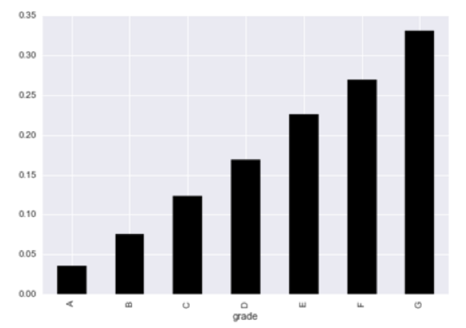

\*As expected, lower grade loans have higher default rates

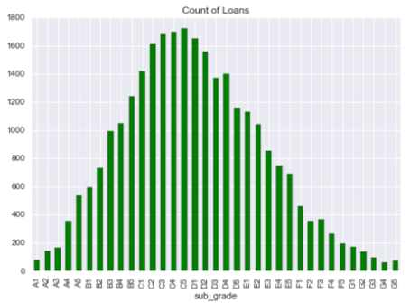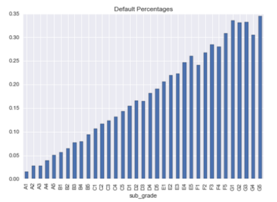

\*As expected, there are higher default rates across lower subgrades but
issuance tends to be more in the mid-tier of loans.

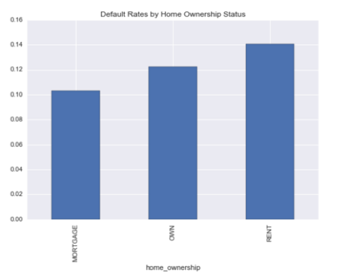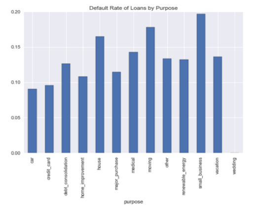

\*Renters tend to have higher default rates as well as small business
loan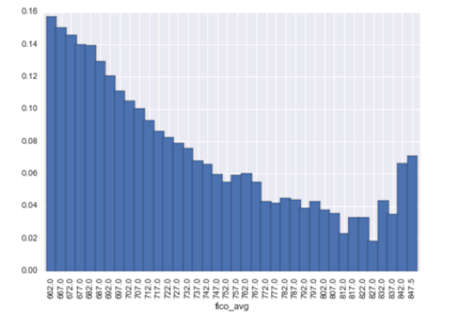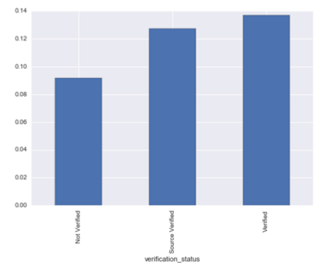

\*Interesting spike at the highest end of the fico\_avg distribution and
verified applicants have higher default rates, perhaps riskier borrowers
need to submit verification prior to approval

[Correlation plot of continuous features with Loan Label
\[default\|performing\]]

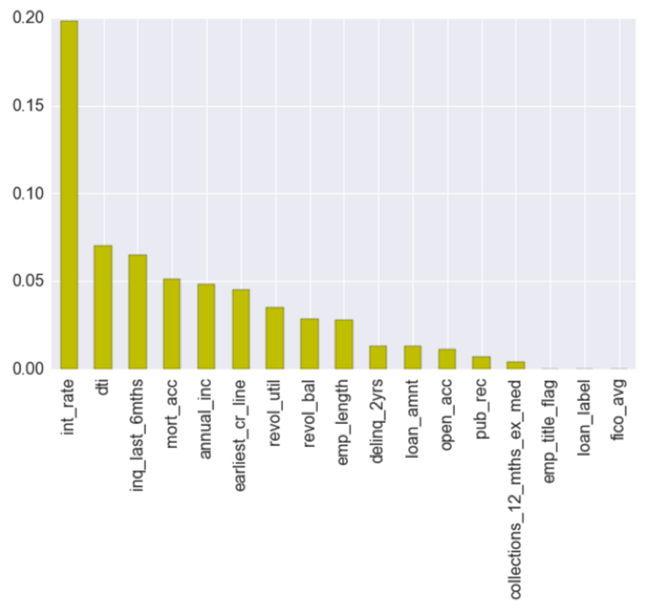

As you can see, the interest rate, dti, and inquiries in the past 6
months tend to have higher correlation (absolute value, can be positive
or negative). Interestingly enough, fico score does not appear to have
much predictive power as was visualized above in the FICO plot (a large
FICO default tail in higher ranges).

**Algorithms and Techniques:**

The categorical features, particularly the text strings for employee
title need to be transformed to allow for our algorithms to extract any
predictive power from them. Therefore, I plan on employing text matching
and some logistical regression to identify and transform some of the
categorical features. Once I finish my cleaning, preprocessing, and
feature transformation; I plan to employ a few algorithms for this
classification problem; starting with logistic regression due to its
intuitive nature, minimal run times for this very large dataset and
feature space, and the insight it provides on individual variables.
After that I will likely employ a more complicated algorithm, random
forests, to see if I can improve my model metrics. I chose the random
forest as it requires minimal tuning and randomly selects features,
which is helpful as I'm not 100% confident that all my features,
particularly my categorical features, are particularly predictive in
nature.

[Background on Methods:]

*Logistic Regression *

*General applications:* Logistic regression is widely used in many
fields such as medicine and marketing. In the former case, an example
would be to classify someone who has a higher likelihood to die. In the
latter case, you can classify a customer propensity to purchase or in
this case propensity to default

*Strengths:* Highly interpretable, fast, minimal tuning required, can
perform well with a small sample

*Weaknesses:* Assumes a linear relationship between features and label,
sensitive to irrelevant features, and cannot automatically learn feature
interactions

*Reason for Choice:* It\'s very easy to interpret, probabilities are
easy to understand for me.

*Random Forest *

*General applications*: Random forests are a version of decision trees
and are used in medicine, finance, and manufacturing.

*Strengths:* Performance is competitive, provides a reliable estimate of
feature importance and interactions, can deal with non-linear
relationships between features and labels.

*Weaknesses*: difficult to interpret, slow to train and predict

*Reason for choice*: can deal with nonlinear relationships and does not
require a lot of tuning

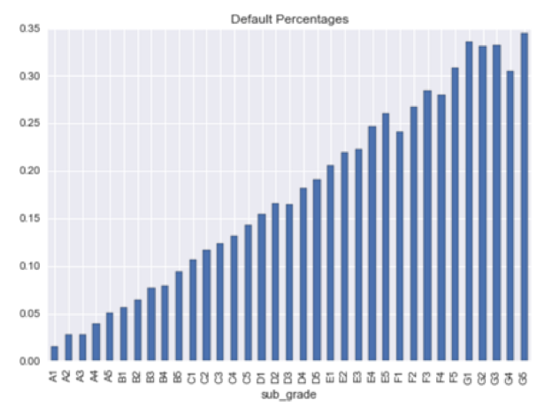

**Benchmarks:**

Each loan is attached a grade and subgrade (which is binning each grade
into 5 tiers of risk). If my model is as or more predictive as using
these features exclusively, I'll know if these last 3 months of work was
justified ;-) The current benchmark AUC using these ratings alone is
**[.6683]** on the test set, therefore that is what we aim
to beat.

Methodology

**Data Preprocessing:**

*1_DataCleansing2014FeatureExtraction.ipynb* - After careful inspection column by
column, I have detailed steps within this notebook.

Steps include:

-removal of features containing greater than 80% null values.

-categorize defaults by loan\_status \>30 days, Charged Off, and Default

-homeownership, relabeled "any" outlier into mortgage bucket after
inspecting mortgage accounts

-transform earliest credit line to be vintage (today - earliest credit
line)

-fico\_avg is the average of the highest and lowest fico ranges, after
careful inspection the difference between these two values is arbitrary
across the entire loan pool.

-all other fields relating to servicing/monitoring loans after issuance
have been removed as rating are given at time of loan issuance and using
these fields would be an unfair advantage.

**Disclaimer:** I had encountered processing difficulties with some
categorical features as converting them to numerical inputs had expanded
the feature space significantly, therefore I employed the method of
breaking them into separate scripts/notebooks in order to be able to run
them across different machines to gain time efficiencies on long run
times and allow easier interpretation of those transformations.

**Implementation:**

After the preprocessing listed above, the next challenge was how to
leverage the two categorical variables employee\_title and zip\_code,
which have \~75k and 865 uniques respectively. I chose to use a third
party package using levenshtein distance (reference below) in order to
allow text matching (fuzzy matching) on employee titles. After employing
this method, the unique fields were still rather large so I used L2
Logistic Regression to evaluate the employee titles that appeared to
have some predictive power and grouped the rest into NoMatch and
Empty/NA titles to further reduce the feature space after dummy encoding
of these categorical features.

[Ridge Regression L2 Penalty]

Take employee title data from KagDataCleansing and run through a
preprocess script I wrote located in the data library, which makes the
text all lowercase, removes non-ascii text, handles some popular
abbreviations, and removes punctuation.

2\) Use text matching script from https://github.com/seatgeek/fuzzywuzzy

3\) Parameters used were setting a threshold of .74 and after testing
various methods, fuzz\_token\_sort\_ratio was chosen as the matching
parameter of choice leveraging Levenshtein distance

4\) Pipe output into L2 logistic regression, while only keeping titles
that have coeficients \>.0005 which reduces the unique title count to a
manageable 153 features.

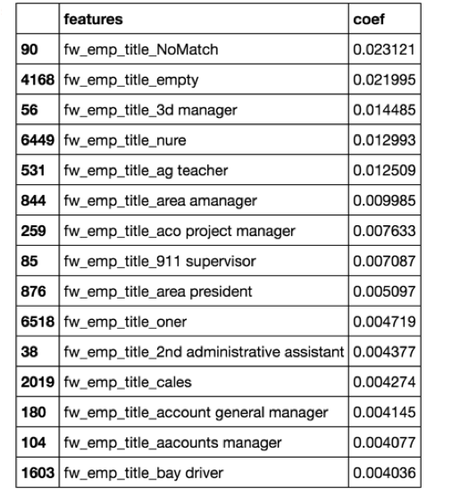

Output:

-f\_norm\_emp\_title - removal of punctuation, non-ascii characters,
lowercase

-fw\_emp\_title - output of fuzzymatch

-fw\_emp\_title\_gt0005 - slimmed down titles only showing some degree
of importance

*4\_GeoEmpTitle\_Feature\_Extraction.ipynb*

This script accepts the input which were employee titles resulting from
Levenshtein distance. It applies the same L2 regression methodology
towards selecting the zipcodes that are the most predictive leveraging
same methodology used above.

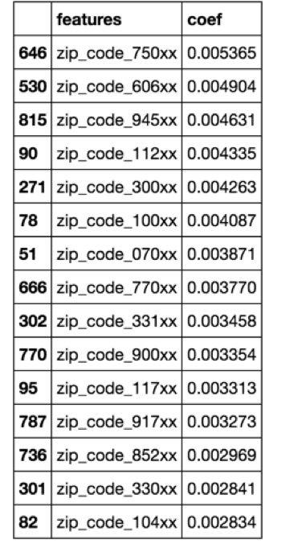

Steps:

Inputs: Output of 3\_EmpTitleFuzzyWuzzyFeatureExtraction.ipynb; containing the
employee titles resulting from Levenshtein distance

Script: Takes zip codes and runs it through L2 Logistic Regression Model
to evaluate categorical features that have some predictive value and
also joins this with the output of the EmpTitleJW.ipynb title script

Outputs: a fully merged file containing predictive zip codes and
employee titles generated from 3\_EmpTitleFuzzyWuzzyFeatureExtraction.ipynb.

**Refinement:**

We now have finalized our sets of features we would like to use for our
logistic regression and random forest models below:

Features = \[\'loan\_amnt\', \'term\', \'int\_rate\', 'emp\_length',
\'home\_ownership\', u\'annual\_inc\', \'verification\_status\',
\'purpose\',

\'dti\', \'delinq\_2yrs\', \'earliest\_cr\_line\', \'inq\_last\_6mths\',
\'open\_acc\', \'pub\_rec\', \'revol\_bal\',

\'revol\_util\', \'initial\_list\_status\',
'zip\_code',\'collections\_12\_mths\_ex\_med\', \'mort\_acc\',

U\'fico\_avg\', \'emp\_length\_cat\', \'fw\_emp\_title\_gt0005\',
\'zip\_gt001\'

[We still have a few outstanding questions left to answer to finalize
our feature set:]

\'zip\_gt001\' :Does our new transformed zip\_code have any predictive
power, if so we shall include it

-'fw\_emp\_title\_gt0005\': Does our new transformed employee\_title
have any predictive power, if so we shall include it

-'emp\_length' or 'emp\_length\_cat': Should we include employee length
as a discrete or continuous feature

*Distribution of Employee Length and Default Rates*

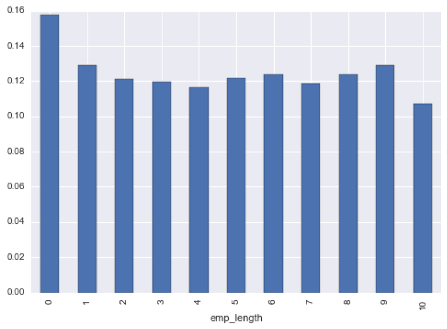

Results

**[Model Evaluation and Validation]**

[There are two files as listed below:]

IVS\_AWS\_10\_24\_LogReg\_Final.ipynb - contains logistic regression
model and results

IVS\_AWS\_10\_24\_RNF.ipynb - contains random forest model and results

**Logistic Regression:**

We are planning on running a logistic regression model, leveraging L2
and penalization (ensure as we add features we want to ensure that the
features added have some predictive value). We will leverage
grid\_search modifying our penalization metric C to see if we can
improve our AUC metric. We are using 3 fold cross-validation and
Stratified-Shuffle-Split to partition our train and test sets, the
stratified shuffle split module ensures that we have a balanced
proportion of defaulted loans in both our train and test sets.

***Model Using Only Subgrade***

*Logistic Regression*

Features     | AUC Train| AUC Test| Notes 
------------- |:--------- | :----- | :-----
Ratings Only | .5705 | .6683 | Run with only the [LC SubRatings*](https://www.lendingclub.com/foliofn/rateDetail.action)|

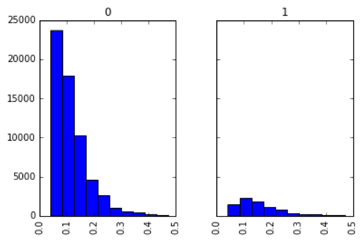

Default probability distribution generated from the model plotted in a
histogram against actual y's.

AUC ROC Curve generated from the model, the farther up and to the left,
the better the model fit. A straight diagonal line indicates that your
model's predictive power is no better than randomness.

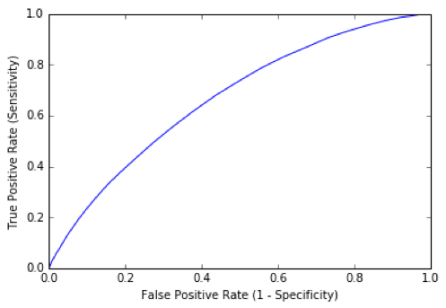

*In order to answer our questions above, we'll run our model and
evaluate the results to select our best model.*

*Logistic Regression*

Features     | AUC Train| AUC Test| Notes 
------------- |:--------- | :----- | :-----
emp\_Length as Categorical   |           .689    |      .6881    |    Length of employment is better modeled as a categorical variable, improves AUC from .687. Therefore, its inclusion in the model will be as a categorical variable.
  zipCode           |                    .6806      |   .6834      |  Inclusion of ZipCode hurts the model (also the feature set explodes to 914 features)
  zip\_Gt001         |                     .6856    |     .6897      |  Inclusion of our ZipCode Transfomer has helped increase the predictive power of our model
  fw\_emp\_title\_gt0005       |          .6857       |  .6934       | Inclusion of fw\_emp\_title\_gt0005 greatly improved our model to .69!
  zip\_Gt001 and fw\_emp\_title\_gt0005 |  .6851    |     .6924    |    Including both of these features appear to hurt our model therefore

From the simulated runs above, we see that employment length as
categorical and using our employee title transformer
(fw\_emp\_title\_gt0005) has yielded the best results.

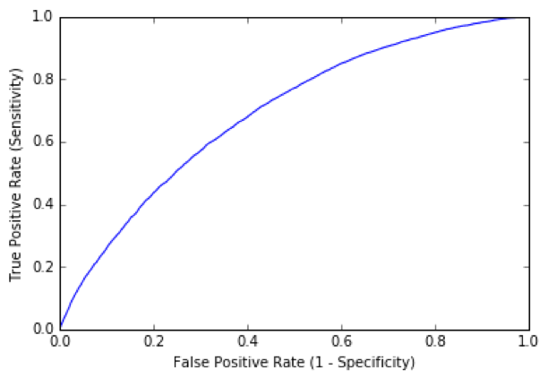

*Here you can see the corresponding ROC curve which moderately improves
and moves up a bit and to the left.*

### 

### 

Here we have finalized our logistic regression model and feature set.

Features = \'loan\_amnt\', \'term\', \'int\_rate\', \'home\_ownership\',
u\'annual\_inc\', \'verification\_status\', \'purpose\',

\'dti\', \'delinq\_2yrs\', \'earliest\_cr\_line\', \'inq\_last\_6mths\',
\'open\_acc\', \'pub\_rec\', \'revol\_bal\',

\'revol\_util\',
\'initial\_list\_status\',\'collections\_12\_mths\_ex\_med\',
\'mort\_acc\',

\'fico\_avg\', \'emp\_length\_cat\', \'fw\_emp\_title\_gt0005\'

Best estimator:

LogisticRegression(C=0.001, class\_weight=None, dual=False,
fit\_intercept=True, intercept\_scaling=1, max\_iter=100,
multi\_class=\'ovr\', n\_jobs=4, penalty=\'l2\', random\_state=401,
solver=\'liblinear\', tol=0.0001, verbose=0, warm\_start=False)

  --------------------------------- ------------- ------------ -------------------------------------------------------------------------------------------------------------------------------------
  *RandomForest*                                               
  *Features*                        *AUC Train*   *AUC Test*   *Notes*
  *zip\_Gt001 & emp\_titlegt0005*   .6905         .6936        *Running a random forest on both of these features *
  *emp\_titlegt0005*                .6902         .6934        *Running on only emptitle, yielding similar results, but training time is 34% faster (5490 vs. 8349 secs) as 201 features vs. 333 *
                                                               
  --------------------------------- ------------- ------------ -------------------------------------------------------------------------------------------------------------------------------------

*Random Forest*

Features     | AUC Train| AUC Test| Notes 
------------- |:--------- | :----- | :-----
 zip\_Gt001 & emp\_titlegt0005  | .6905    |     .6936    |    *unning a random forest on both of these features 
  emp\_titlegt0005*     |          .6902     |    .6934    |    Running on only emptitle, yielding similar results, but training time is 34% faster (5490 vs. 8349 secs) as 201 features vs. 333 

Parameter Tuning for Random Forest:

Number of Trees:

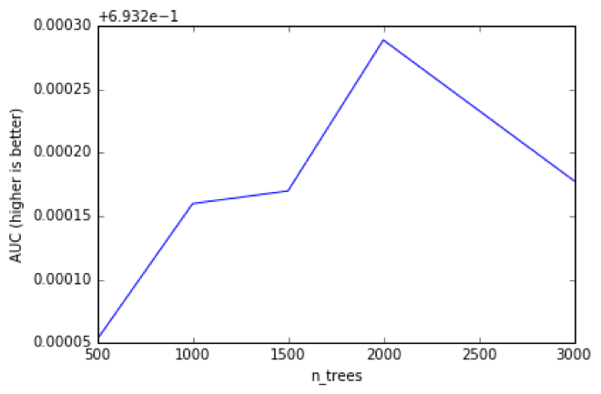

{\'n\_estimators\': 500, \'auc\': 0.693253}\
{\'n\_estimators\': 1000, \'auc\': 0.69336}\
{\'n\_estimators\': 1500, \'auc\': 0.69337}\
{\'n\_estimators\': 2000, \'auc\': 0.693489}\
{\'n\_estimators\': 3000, \'auc\': 0.693378}

Number of Features: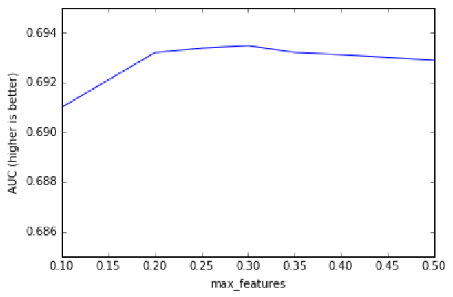

{\'auc\': 0.690995, \'max\_features\': 0.1},\
{\'auc\': 0.693189, \'max\_features\': 0.2},\
{\'auc\': 0.693366, \'max\_features\': 0.25},\
{\'auc\': 0.693467, \'max\_features\': 0.3},\
{\'auc\': 0.6932, \'max\_features\': 0.35},\
{\'auc\': 0.693106, \'max\_features\': 0.4},\
{\'auc\': 0.692884, \'max\_features\': 0.5}

Justification:

As you can see, our model's final solution is much better than using the
subgrade ratings alone to predict default probability and
leveraging/transforming our feature set and tuning our model iteratively
has improved our model performance from .6683 to [.6924].

Conclusion

**[Reflection:]{.underline}**

After importing the dataset and going column by column exploring the
feature set and running some cursory analysis, identifying and cleaning
the features that were relevant was particularly the most time consuming
task. Particularly handling the categorical features like
employee\_title was particularly challenging (originally I had 74k
unique employee titles). At first I wanted to see if employee title had
any predictive qualities, first by identifying if Null (empty) vs.
Filled yielded any positive results, which it did. I then decided that
embarking on fuzzy matching to both group similar employee titles and
remove the titles that were either less prevalent and/or had little
predictive value via L2 logistic regression could pair down this feature
to allow me to use it in my model. Zip codes had less total uniques
\<850, but by itself didn't appear to offer any predictive power. But I
employed the same L2 Logistic Regression approach to try to identify the
relevant zip codes just in case, as I desperately wanted to keep as much
relevant data in my model as possible and chose to run my models with
and without this zip code feature to assess its impact. I then ran a
logistic regression model and random forest model and was able to
improve my AUC metric and produce a predictive model that exceeded my
benchmark (which leveraged subratings of each loan that was initially
provided in the dataset).

The most interesting thing I found was that a model is only as good as
its inputs, and how important feature selection is. Although painful,
the employee title feature transformation was incredibly valuable and
worth the level of effort involved as it was one of the few
characteristics that really improved my AUC metric. It was also equally
interesting how some of these features behaved when combined with other
features. For example, employee tenure was particularly interesting as
when I used it as a categorical feature instead of as a numerical input,
my model improved. After looking at the distribution, I could see that
there wasn't an implicit linear relationship between length of
employment and default probability, but when combined with other
features; it then became valuable; perhaps a subset of ppl who have been
employed for a while are more likely to default or this input could be
subject to fraud.

The most difficult aspects of the project were the computational time
and really learning to value performance time. At one point my dataset
had 220k rows with 1,000+ features which made running my models
extremely time consuming or impossible leveraging my local machine
alone. Also the fuzzy matching algorithms are particularly expensive
computationally and my implementation didn't allow me to run them in
parallel which again dramatically increased my run times. Therefore, I
had to get smarter by running some models on a remote AWS machine and
also reduce my feature space to something more manageable.

My final model and solution didn't fit my expectations of the problem as
I thought it would have been much easier to predict defaults given the
inputs I had. I quickly realized that this would be a lot harder to
improve than I originally thought and really working on my feature
selections allowed me to improve my model, but I had thought its
improvement would have been much more dramatic than the end result.

**[Improvement:]**

I strongly believe I can improve my fuzzy matching by both tuning the
fuzzywuzzy module I imported and also possibly leveraging the
Jaro-Winkler functionality in the Jellyfish package to make my matches
more relevant. I also think that zip code when used on its own was not
helpful, but possibly combining it with some publically available data
on those geographies might help improve my model. Lastly, I think
possibly leveraging another algorithm such as gradient boosting machines
may be interesting to see if it can further improve my model. Although
not incredibly familiar with this algorithm, from what I have read GBM
in certain circumstances can outperform random forest models, but that
they require significant tuning. If I used my final solution as a
benchmark I believe that I could still improve this by implementing the
steps above, both working on my feature set a bit more as discussed and
testing out another algorithm such as GBM.
